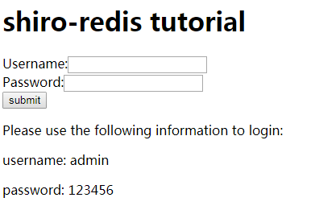
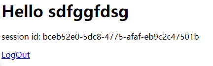
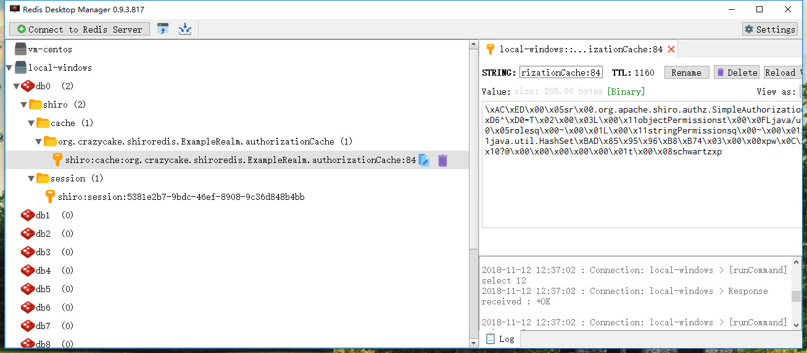

# shiro-redis-spring-tutorial
In this tutorial, you see how to configure `shiro-redis` in `spring` framework

# How to use it?

1. Use the following comment to clone shiro-redis-spring-tutorial to your disk:
```
git clone https://github.com/alexxiyang/shiro-redis-spring-tutorial.git
```
2. Modify redis service connection configuration in `src/main/resources/applicationContext.xml`

```XML
<bean id="redisManager" class="org.crazycake.shiro.RedisManager">
        <property name="host" value="192.168.56.101:6379"/>
        <property name="expire" value="1800"/>
        <!-- optional properties:
        <property name="timeout" value="10000"/>
        <property name="password" value="123456"/>
        <property name="database" value="1"/>
        <property name="jedisPoolConfig" ref="jedisPoolConfig"/>
        <property name="count" value="100"/>
        -->
</bean>
```

3. Run jetty
```
mvn jetty:run
```

4. Visit `http://localhost:8080`, you will see login page:



5. Use the username and password wrote on login page to sign in.
Then you will see the successful page:



6. Use redis client to check redis data. For example, use `Redis Desktop Manager`:



It means shiro use redis as its session and cache solution successfully.

# If you found any problems

Please send email to alexxiyang@gmail.com

可以用中文